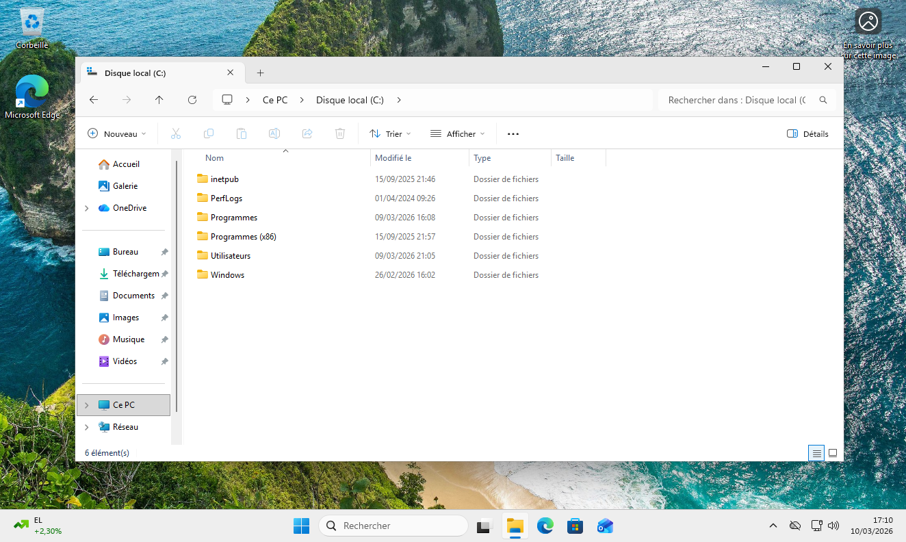
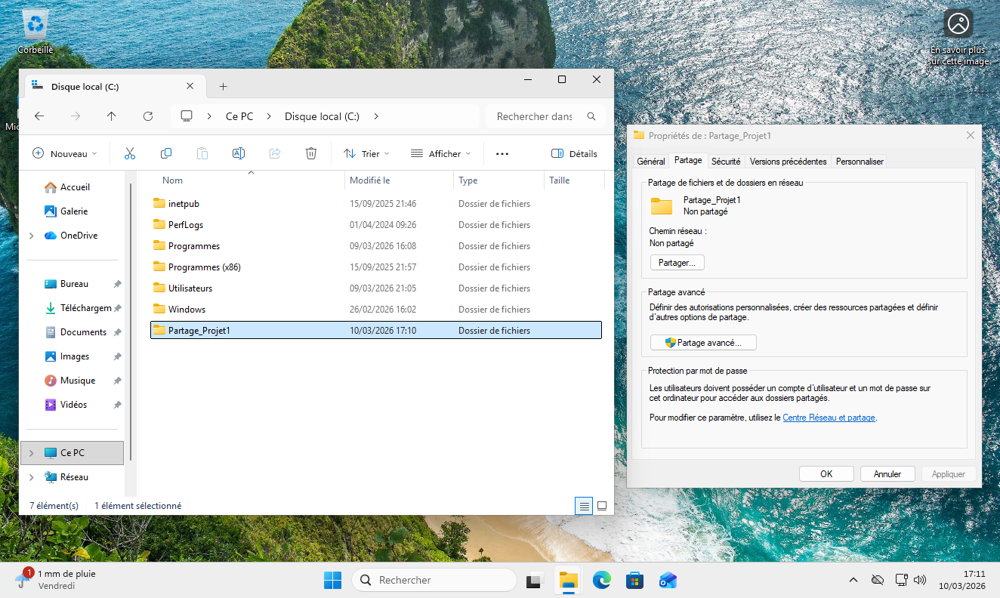

### Préparation des cibles : Création de services vulnérables sur WIN01 (Windows 11)

### Objectif technique
Afin que notre outil de cartographie (Nmap) puisse détecter des ports ouverts, il ne suffit pas de désactiver le pare-feu. Un port réseau n'apparaît comme "ouvert" que si une application ou un service est en cours d'exécution et "écoute" le trafic entrant sur ce port. 

Pour simuler un environnement d'entreprise réaliste et vulnérable, nous avons volontairement activé deux services critiques et fréquemment ciblés par les attaquants sur notre client Windows 11 (IP : 172.16.10.10) : le partage de fichiers (SMB) et le Bureau à distance (RDP).

### Faille 1 : Activation du protocole SMB (Port TCP 445)
Le protocole SMB (Server Message Block) est utilisé pour le partage de ressources sur le réseau.
* **Procédure de mise en place :**
1. Ouverture de l'Explorateur de fichiers sur le lecteur `C:`.

2. Création d'un dossier nommé `Partage_Projet`

3. Accès aux **Propriétés** du dossier > Onglet **Partage** > **Partage avancé**.![[Activation de l'option Partager ce dossier et validation..png]]

4. Activation de l'option **Partager ce dossier** et validation.
* **Résultat :** Le système d'exploitation lance le service de partage et se met en écoute sur le port **445**.

### Faille 2 : Activation du protocole RDP (Port TCP 3389)
Le protocole RDP (Remote Desktop Protocol) permet la prise de contrôle à distance de la machine.
* **Procédure de mise en place :**
1. Accès aux **Paramètres** de Windows 11 > **Système** > **Bureau à distance**.![[Accès aux Paramètres de Windows 11 - Système - Bureau à distance 1.png]]
2. Bascule du commutateur sur **Activé**.
3. Validation de l'avertissement de sécurité Windows.![[Bascule du commutateur sur Activé et validation.png]]
* **Résultat :** Le service de bureau à distance est démarré et écoute sur le port **3389**.

### Validation locale de l'ouverture des ports
Avant de procéder aux tests distants avec notre client Linux, nous avons vérifié localement que les services répondaient bien. 
Depuis une Invite de commandes (en tant qu'administrateur), la commande suivante a été exécutée :
`netstat -ano | findstr "LISTENING"`
![[Vérification local des ports ouverts win11.png]]
**Résultat attendu :** Les lignes indiquant l'écoute sur `0.0.0.0:445` et `0.0.0.0:3389` sont bien présentes, confirmant que la cible est prête à être analysée.
