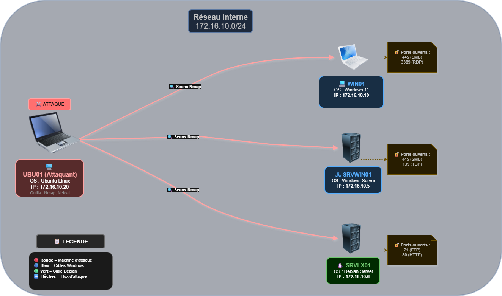

# **PROJET : Analyse et cartographie des ports réseau**
## Sommaire

- [Le projet](#le-projet)
- [Les membres du groupe et leurs rôles](#les-membres-du-groupe-et-leurs-rôles)
- [Choix techniques](#choix-techniques)
- [Difficultés rencontrées](#difficultés-rencontrées)
- [Solutions trouvées](#solutions-trouvées)
- [Amélioration possibles](#améliorations-possibles)
---
### Le projet

**Nos missions principales :**
* **Cartographie de l'infrastructure :** Utiliser une machine d'attaque sous Linux (Ubuntu) pour balayer un réseau cible et identifier les équipements actifs.
* **Analyse de vulnérabilités :** Sonder les ports ouverts sur les différents systèmes d'exploitation (Windows 11, Windows Server 2025, Debian 13) pour détecter les services en cours d'exécution et identifier d'éventuelles failles de configuration.

**Notre mission secondaire :**
* **Automatisation :** Concevoir un script Bash interactif permettant d'automatiser ces scans via des profils prédéfinis (rapide, furtif, agressif) afin de fournir un outil réutilisable par d'autres techniciens.

**Environnement technique :**
Le laboratoire est entièrement virtualisé. Les machines communiquent au sein d'un réseau interne isolé, ce qui permet d'exécuter des analyses réseau intrusives.

---
### Les membres du groupe et leurs rôles

Afin de mener à bien ce projet dans le temps imparti, nous avons fonctionné en méthode Agile (Scrum) sur deux sprints, en nous répartissant les cibles d'audit.

| Membre de l'équipe | Rôle Sprint 1 | Rôle Sprint 2 | Missions techniques principales |
| :--- | :--- | :--- | :--- |
| **Alexandre** | Scrum Master | Technicien | Audit et documentation de la cible Windows 11 / Ecriture du README.md |
| **Xavier** | Product Owner | Technicien | Audit et documentation de la cible Debian 13 Server / Ecriture du script Bash |
| **Revine** | Technicien | Scrum Master | Audit et documentation de la cible Debian 13 Server / Ecriture du README.md |
| **Mohamed** | Technicien | Product Owner | Audit et documentation de la cible Windows Server 2025 / Ecriture du README.md |

---
### Choix techniques 

Toutes les machines sont configurées sur le réseau interne de VirtualBox avec le masque `255.255.255.0` (/24).

| Rôle | Nom de la VM | OS | Adresse IP | Identifiant | Mot de passe |
| :--- | :--- | :--- | :--- | :--- | :--- |
| **Attaquant** | UBU01 | Ubuntu 24 LTS | 172.16.10.20 | wilder | Azerty1* |
| **Cible 1** | WIN01 | Windows 11 Pro | 172.16.10.10 | Wilder | Azerty1* |
| **Cible 2** | SRVWIN01 | Windows Server 2025 | 172.16.10.5 | Administrateur | Azerty1* |
| **Cible 3** | SRVLX01 | Debian 13 CLI | 172.16.10.6 | root / wilder | Azerty1* |

---

### Logiciels utilisés

Nous nous sommes appuyés sur deux outils complémentaires :

**1. Nmap** 

C'est notre scanner réseau principal. Nous l'avons utilisé pour :
* Balayer le réseau et identifier les machines actives.
* Lister les ports ouverts sur nos différentes cibles (Windows, Debian).
* Détecter les versions exactes des services en écoute, pour déduire les failles de sécurité.

**2. Netcat (Ncat)**

L'outil historique Netcat a évolué et nous utilisons ici Ncat, sa version moderne intégrée directement au projet Nmap. Ncat permet d'établir des connexions directes entre différentes machines, à la manière d'une connexion SSH, mais en transmettant les données en texte clair (sans chiffrement).

---
### Difficultés rencontrées 

- Ouvrir des ports sur Debian 13 Server
- utilisation de NetCat
- compréhension de la demande du client

---
### Solutions trouvées 

- Utilisation de Ncat pour ouvrir les ports et de maintenir ouvert les ports pour la demonstration sur Debian 13 Server
- utilisation de nmap seulement
- mise au clair de la demande avec le client

---
### Améliorations possibles

- Paramètrage d'un serveur Apache
