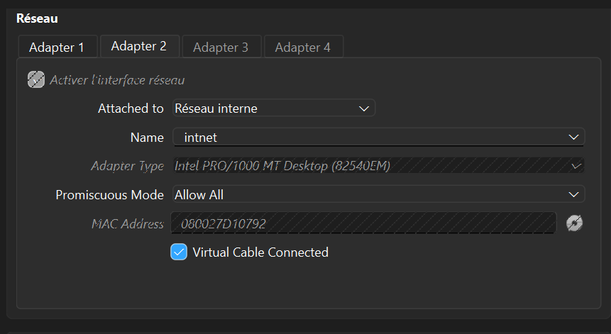
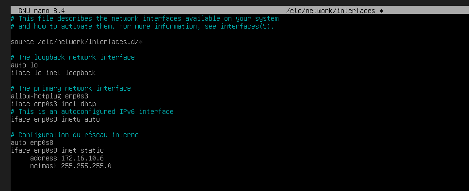
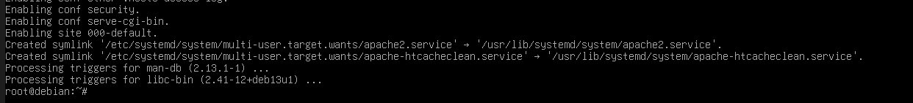
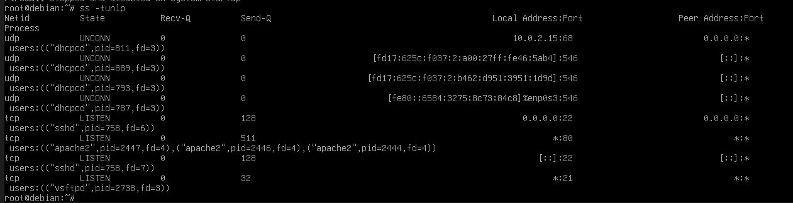
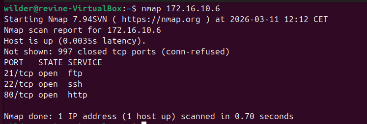
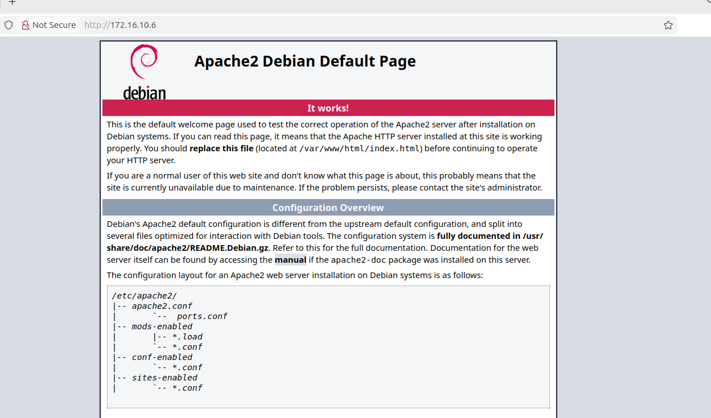

# Rapport Technique : Analyse et Cartographie des Ports Réseau
**Projet :** TSSR - Sprint 1 (Infrastructure et Vulnérabilisation)
**Technicien :** Revine
**Cible :** SRVLX01 (Debian 13)

---

## I. Introduction et Contexte
Dans le cadre du projet d'analyse réseau de l'Équipe 3, ma mission consiste à préparer une cible Linux (Debian 13) isolée. L'objectif est d'implémenter des services spécifiques afin de simuler des vulnérabilités exploitables lors des phases d'audit. Ce document détaille la configuration système et l'ouverture des vecteurs d'attaque.

## II. Architecture Réseau et Isolation
La machine virtuelle est déployée sous l'hyperviseur VirtualBox. Pour garantir l'étanchéité de l'environnement de test et permettre une analyse de trafic non filtrée (indispensable pour les scans de ports), la configuration suivante a été appliquée sur l'interface de la VM :

* **Mode d'accès :** Réseau interne (`intnet`)
* **Mode Promiscuité :** "Autoriser tout"

> 

## III. Configuration de la Couche Réseau (OS)
### 3.1 Adressage IP Statique
Afin d'assurer la persistance de l'hôte lors des scans de découverte, l'interface `enp0s8` a été configurée en adressage statique via l'édition du fichier système `/etc/network/interfaces`.

**Commande :** `nano /etc/network/interfaces`

* **IPv4 :** 172.16.10.6
* **Masque :** 255.255.255.0

> 

### 3.2 Validation de l'état de l'interface
Après application des paramètres et redémarrage du service networking, la commande `ip a` confirme que l'interface est opérationnelle ("UP") et possède l'adressage IP correct.

**Commande :** `ip a`

> 

## IV. Implémentation des Services (Vulnérabilisation)
Conformément au planning du Sprint 1, j'ai procédé à l'installation de deux daemons exposant des ports TCP critiques pour simuler une surface d'attaque.

### 4.1 Service HTTP (Apache2) - Port 80
Installation du serveur Web Apache pour simuler une interface de gestion non sécurisée.

**Commande :** `apt update && apt install apache2 -y`

> 

### 4.2 Service FTP (vsftpd) - Port 21
Déploiement du service de transfert de fichiers vsftpd pour simuler un vecteur d'exfiltration de données en clair (protocole non chiffré).

**Commande :** `apt install vsftpd -y`

> 

## V. Audit et Vérification de la Surface d'Exposition
La validation du paramétrage repose sur une analyse locale des sockets et un scan distant de conformité.

### 5.1 Analyse locale des sockets (ss)
La commande ss -tunlp confirme que les services Apache et vsftpd sont en état d'écoute (state LISTEN) sur les ports respectifs 80 et 21.

**Commande :** `ss -tunlp`

> 

### 5.2 Scan de reconnaissance distant (Nmap)
Un scan de découverte a été réalisé depuis la machine attaquante du laboratoire (UBU01 - 172.16.10.20). Les résultats valident l'ouverture effective et la visibilité des ports 21 (FTP) et 80 (HTTP) depuis le réseau.

**Commande :** `nmap 172.16.10.6`

> 

### 5.3 Test de réponse applicative (HTTP)
La connectivité est confirmée par l'accès à la page par défaut d'Apache depuis le navigateur de la machine d'attaque, prouvant que le service est fonctionnel.

> 

---

## Conclusion : 
La cible SRVLX01 est opérationnelle. L'isolation réseau est effective et les services vulnérables sont correctement exposés.
