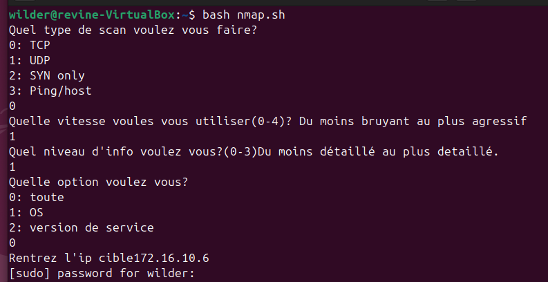
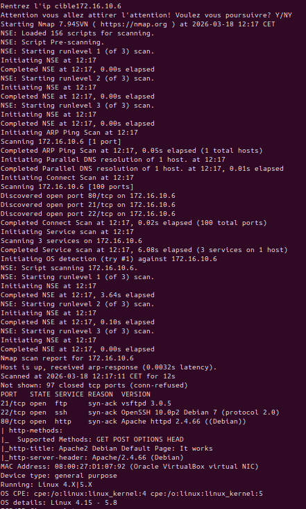
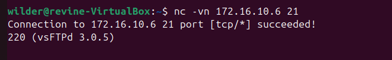

# Guide d'Utilisation de l'outil de Scan (USER GUIDE)

Bienvenue dans le guide d'utilisation de notre projet de cartographie réseau. Ce document vous explique comment utiliser notre script automatisé et comment vérifier les résultats.


### 1. Le but de l'outil

Afin de simplifier l'utilisation de Nmap, nous avons créé un script interactif personnalisé. Son but est de vous guider pas à pas pour scanner une cible, découvrir les ports ouverts et identifier les services vulnérables sur notre réseau isolé.


### 2. Comment le lancer

Ouvrez un terminal sur votre machine d'attaque (par exemple notre machine Ubuntu UBU01 - 172.16.10.20), allez dans le dossier du projet, puis exécutez simplement le script avec les droits administrateur :
```bash
nmap.sh
```


### 3. Ce qu'il faut saisir

Une fois lancé, le script fonctionne comme un menu interactif. Il va vous demander de taper un numéro pour choisir vos options :

- **Le type de scan que l'on veut.**
- **La vitesse du scan :** Attention : plus le scan est rapide, plus il risque de se faire repérer et bloquer par un pare-feu.
- **Le niveau d'information que va retourner le scan.**
- **Les options supplémentaires, notamment la recherche de version ou d'OS**
- **L'adresse IP :** Enfin, tapez l'adresse de la cible (par exemple `172.16.10.6` pour notre serveur Debian) et appuyez sur Entrée.
  



### 4. Comment lire les résultats

À la fin du processus, le script affiche le résultat du scan à l'écran. Regardez la colonne **STATE** (état). Si la ligne indique **`open`** (ouvert), c'est que vous avez trouvé une cible :

- **Cible Linux :** Vous verrez notamment les ports **21** (FTP) et **80** (HTTP) ouverts.
  



### 5. Exemple simple : Vérification manuelle

Une fois que le script vous a montré que les ports sont ouverts, vous pouvez vérifier manuellement que les services répondent bien :

**Vérification du Port 80 (Web) :**

Ouvrez le navigateur internet de la machine d'attaque et tapez :
```
http://172.16.10.6
```

La connectivité est confirmée si vous arrivez sur la page par défaut d'Apache.


**Vérification du Port 21 (FTP) :**

Dans votre terminal (machine d'attaque - Ubuntu), tapez la commande :
```bash
nc 172.16.10.6 21
```

La réception du message 220 (vsFTPd 3.0.3) confirme que le service vsFTPd est bien ouvert sur la cible et accessible à distance depuis notre machine d'attaque.




### 6. Détails des commandes Nmap utilisées

Pour les utilisateurs avancés, voici les commandes et options que le script exécute automatiquement selon vos choix :

**Les types de scans principaux :**

| Commande      | Description                                      |
|---------------|--------------------------------------------------|
| `nmap -sn`    | Scan de découverte (pour voir qui est en ligne). |
| `nmap -sT`    | Scan TCP complet (3-way handshake).              |
| `nmap -sS`    | Scan SYN (plus discret).                         |
| `nmap -sU`    | Scan des ports UDP.                              |

**Les options de précision :**

| Option  | Description                                                        |
|---------|--------------------------------------------------------------------|
| `-O`    | Détection du système d'exploitation (OS).                          |
| `-sV`   | Détection de la version des services.                              |
| `-A`    | Options complètes (OS, versions, scripts).                         |
| `-Pn`   | Ignore la vérification de présence (si la cible cache ses pings).  |

**Le bruit (Vitesse) :**
```
De T0 (très discret) à T4 (très rapide/agressif).
```

**Les sorties :**

| Option              | Description              |
|---------------------|--------------------------|
| `-oN <filename>`    | Normal output            |
| `-oX <filename>`    | XML output               |
| `-oG <filename>`    | Grepable output (utile pour grep et awk) |
